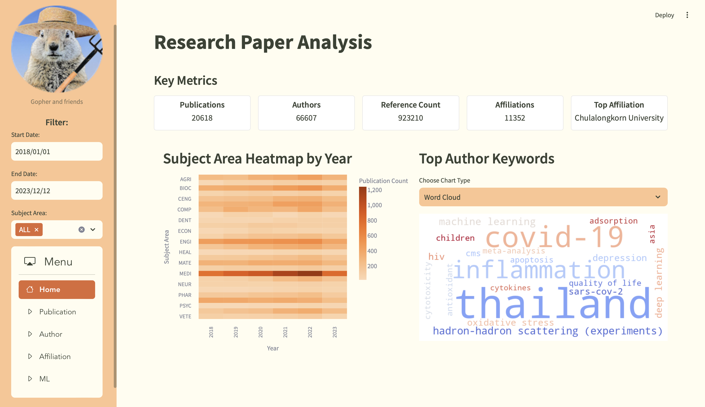

# 📚 Research Paper Analysis Dashboard

A comprehensive dashboard built using **Streamlit** to analyze research papers, providing insights into publications, authors, affiliations, and leveraging **machine learning** to predict research categories.

---

## 🚀 **Project Overview**
This project is a part of Data Science Course at Chulalongkorn University, aiming to streamline the analysis of research papers using a data-driven dashboard. The dashboard offers five main sections:

1. **Home:** Overview of key metrics and trends.
2. **Publication:** Detailed analysis of publication trends and impact.
3. **Author:** Insights into author contributions and collaboration networks.
4. **Affiliation:** Visualization of institutional and geographical research impact.
5. **ML (Machine Learning):** Predicts research categories using an AI model.

---

## 🎯 **Key Features**
- **Dynamic Filtering:** Filter research data by date and subject area.
- **Interactive Visualizations:** Line charts, bar charts, pie charts, network graphs, and geolocation maps.
- **Machine Learning Integration:** Predicts the research subject area from text using a pre-trained model.

---

## 🧠 **Machine Learning Model**
The ml model, hosted on **Hugging Face**, classifies research abstracts into six categories:
- Sciences
- Health and Medicine
- Engineering and Technology
- Arts and Social Sciences and Humanities
- Mathematics and Multidisciplinary
- Economic and Business and Finance

---

## 🧰 **Technologies Used**
- **Frontend & Dashboard:** Streamlit
- **Data Handling:** Pandas
- **Visualizations:** Matplotlib, Plotly, Pydeck, Altair
- **Machine Learning:** Hugging Face Transformers, PyTorch
- **Database:** MongoDB

---

## 🌟 **Acknowledgements**
Special thanks to my professor, the TAs, and all my group members for their support and contributions!
